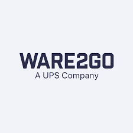

<link
      rel="stylesheet"
      href="https://cdnjs.cloudflare.com/ajax/libs/font-awesome/4.7.0/css/font-awesome.min.css"/>
<link rel="icon" type="image/x-icon" href="images/favicon.ico">
<!-- Replace this with your own banner image -->

  <h1>Hi there! I'm Vaibhav Tyagi 👋</h1>

I'm Vaibhav Tyagi, a software engineer based in Redmond, Washington, with a master's degree in Computer Science from the University of Texas at Dallas. With over 3 years of experience in software engineering, I've developed a passion for designing and developing efficient algorithms, automating processes, and improving code performance. When I'm not coding, you can find me capturing moments through photography, hiking, or cheering on my favorite football team. I'm always excited to meet new people, share experiences, and learn from others. Let's connect and explore opportunities to drive innovation and growth together!

  <a href="VaibhavTyagi_resume_2026.pdf" target="_blank">
    <button class="button" role="button" style="background-color: #98FB98; color: black;">
      
        Resume
      
    </button>
  </a>

<h2 align="center">🔧 Skills</h2>

  

<ul>
  <li>
    <h4>Programming Languages</h4>
    C++, C#, Python, Java, SQL, Shell Script
  </li>
  <li>
  <h4>Operating Systems:</h4>
    Mac OS, Windows, Linux (Ubuntu)
  </li>
  <li>
  <h4>Libraries and Tools:</h4>
    Git, GitHub SDK, Spark, UiPath, Datadog, Databricks, Azure DevOps, Azure SDK, Azure Batch, Azure ServiceBus, Azure BlobStorage, Azure Data Lake, OpenAI SDK, MCP
  </li>
  <li>
  <h4>Databases</h4>
    Azure CosmosDB, BigQuery, MySQL, PostgreSQL
  </li>
  <li>
  <h4>Frameworks</h4>
    .NET, Django, Bootstrap
  </li>
</ul>

<h2 align="center"> 💼 Work Experience </h2>

<h3> Software Engineer | SeekOut, Bellevue </h3>
<h4>&#x1F5D3; July 2023 – Present</h4>
<ul>
  <li style="text-align: justify;">Designed and launched a Databricks Genie Space over curated ATS datasets, enabling natural-language querying for both engineers debugging data issues and ~20 Customer Success Managers extracting customer insights, eliminating ad-hoc data pulls from the engineering team.</li>
  <li style="text-align: justify;">Developed an MCP-based auto-debug agent integrating Slack alerts, Azure App Insights, Jira, and GitHub to automatically diagnose production incidents and raise review-ready PRs with fixes, cutting incident resolution time from 30 mins–2 days to under 5 mins; built as an extensible framework adoptable by any engineering team.</li>
  <li style="text-align: justify;">Architected and implemented an end-to-end ROI Report System — built Databricks pipelines ingesting ATS events and customer data into bronze/silver tables, layered tiered materialized views for transformation and enrichment, and surfaced insights through a live Tableau dashboard; replaced a 1+ week manual process with daily-refreshed, self-serve ROI summary, candidate funnel, and diversity metrics for Customer Success Managers with sub-second filter performance over 600K+ rows.</li>
  <li style="text-align: justify;">Developed and integrated a ChatGPT-powered service using the OpenAI SDK to generate stage mappings automatically, enhancing accuracy and significantly reducing manual effort in aligning customer ATS stages with reporting.</li>
  <li style="text-align: justify;">Architected a reusable driver application to decouple client operations, ensuring fault isolation and eliminating cross-client dependencies. Enhanced scalability, reduced onboarding time by 70%, and streamlined customer integration with infrastructure on Azure Cosmos DB, Batch, Blob Storage, and Service Bus Topics.</li>
  <li style="text-align: justify;">Built a deduplication service for attachment extractors, resulting in a significant reduction of 80% in download API calls and blob read/write operations, leading to cost savings and improved code efficiency.</li>
  <li style="text-align: justify;">Implemented a scalable Bronze Table framework and redesigned the transformation logic to read from bronze tables, improving transformation efficiency by 60%. This solution enabled reliable reprocessing in case of data inconsistencies or logic issues, served as a source of truth.</li>
  <li style="text-align: justify;">Redesigned the strategy for building the Applicant Review feature, enabling seamless integration of candidate data from ATS platforms. This enhancement allowed recruiters to manage workflows from a unified platform, simplifying and streamlining the hiring process.</li>
  <li style="text-align: justify;">Improved system reliability by reducing redundant service bus requests and achieving a 90% drop in throttling, while revamping telemetry logging with standardized conventions and telemetry initializers, cutting debugging time by 50% and eliminating redundant log costs.</li>
  <li style="text-align: justify;">Designed and implemented an algorithm to detect, process, and preserve sequence of DeadLetterQueue (DLQ) messages using C# and Azure SDK, achieving a 95% reduction in manual efforts and significant time savings.</li>
  <li style="text-align: justify;">Built CI/CD pipelines leveraging Python, DevOps, shell scripting, and GitHub SDK to streamline build and deployment workflows, uploading only modified modules and reducing deployment times by 80%. Also built Azure Logic App alert dashboards and an automated CleanUp Service to remove unused resources tied to inactive customers — improving issue detection and cutting infrastructure costs.</li>
</ul>
    
<h3> Data Analyst Intern | Ware2Go (A UPS Company), Atlanta </h3>
<h4>&#x1F5D3; Jan 2023 – May 2023 </h4>

<ul>
  <li style="text-align: justify;">Implemented an automated data import process using UiPath and C# to seamlessly transfer data from Softeon to Big Query, enhancing accuracy to 
100% and eliminating discrepancies</li>
  <li style="text-align: justify;">Reduced data latency from 24 hours to 30 minutes, enhancing generated report precision on the DOMO platform.</li>
  <li style="text-align: justify;">Created a customized automation process to compare prices between UPS and other vendors to gather detailed information on differences in rate 
based on factors like location, weight, and packaging to facilitate improved decision-making. </li>
  <li style="text-align: justify;">Analyzed business reports in Domo, extracting insights from Big Query data, and summarized functionalities into Excel for team reference. </li>
</ul>

<h3>  Software Engineer Intern | SeekOut, Bellevue </h3>
<h4>&#x1F5D3; May 2022 – Aug 2022</h4>

<ul>
  <li style="text-align: justify;">Executed a large-scale data pipeline powering SeekOut's security clearance feature, refreshing the tag map with 6M+ job listings spanning 1.5 years, ensuring accurate and up-to-date clearance classifications for customers.</li>
  <li style="text-align: justify;">Implemented a project in C# and .NET framework to validate security clearance input and output file schemas at each stage of the data pipeline, 
reporting users on missing keys and invalid data fields.</li>
  <li style="text-align: justify;">Contributed to Confluence by documenting the current infrastructure of the data pipeline and schema validation code, while also reviewing the 
security clearance feature architecture and proposing enhancements for improved speed and accuracy.</li>
</ul>

<h3> Software Engineer | Yardi Systems Inc, India</h3>
<h4>&#x1F5D3; Aug 2019 - Apr 2021</h4>

<ul>
  <li style="text-align: justify;">Managed Yardi's real estate management database comprising almost 20,000 customers, utilizing advanced SQL scripting to rectify anomalies and 
ensure a consistently high-quality database. </li>
  <li style="text-align: justify;">Developed SQL scripts to generate conversion rate insights reports in collaboration with approximately 25 clients' account managers.</li>
  <li style="text-align: justify;">Conducted beta-testing of client website user interface, analyzed user feedback, reported bugs, and optimized website’s functionality</li>
</ul>

<h2 align="center">🎓 Education</h2>

- MS in Computer Science from &#127979; The University of Texas at Dallas, Dallas, Texas, &#x1F5D3; May 2023
- BE in Computer Engineering from &#127979; Savitribai Phule Pune University, Pune, India, &#x1F5D3; May 2019

<h2 align="center">🤖 Projects</h2>

### Library Management System
&#x1F4BB; TechStack: Python 3, MySQL, Django, Bootstrap, HTML, CSS

  I developed a comprehensive system for librarians that includes
  book search, check-in/check-out functionality, borrower
  management, authentication, and fine management features,
  allowing librarians to efficiently manage the library operations
  and track fines.

<a
  href="https://github.com/IamVaibhavTyagi/Library-Management-System"
  target="_blank"
  class="social-links"><button style="background-color: Yellow; color: black;" class="button fa fa-github">&nbsp;Github</button>
</a>
  

### Instant Messaging Application
&#x1F4BB; TechStack: Java 

  I developed a secure messaging system using Java with AES and
  RSA encryption algorithms. It includes public key cryptography
  for authentication, nonce encryption for authenticity
  verification, and AES 128-bit encryption for message
  confidentiality.

<a
  href="https://github.com/IamVaibhavTyagi/Instant-Messaging-Application"
  target="_blank"
  class="social-links"><button style="background-color: Yellow; color: black;" class="button fa fa-github">&nbsp;Github</button>
</a>

### Real-time Stock Price & Analysis Bot
&#x1F4BB; TechStack: Python 3, NSEpy, NumPy, Matplotlib 

  Developed a bot to give live price of a National Stock Exchange
  (NSE) stock upon messaging the stock symbol. Created a technical
  analysis module giving market performance of a stock using data
  of last 6 months.

<a
  href="https://github.com/IamVaibhavTyagi/stock-price-analysis-bot"
  target="_blank"
  class="social-links"><button style="background-color: Yellow; color: black;" class="button fa fa-github">&nbsp;Github</button>
</a>

### ATM Surveillance System
&#x1F4BB; TechStack: Java, OpenCV, SQL 

  I collaborated with a team to develop a CCTV-based monitoring
  system for restricted areas. The system included an anti-theft
  module with alarm triggers and notifications to security
  personnel. Additionally, I implemented a face verification
  feature to ensure secure transactions.

<a
  href="https://github.com/IamVaibhavTyagi/ATM-Surveillance"
  target="_blank"
  class="social-links"><button style="background-color: Yellow; color: black;" class="button fa fa-github">&nbsp;Github</button>
</a>

### Crime Reporting System
&#x1F4BB; TechStack: Python 3, MySQL, Pandas, Matplotlib 

  Led a team of 3 to design an application to keep crime reports
  safe, secure and yield significant insights from the data.

<a href="https://github.com/IamVaibhavTyagi/Crime-Reporting-System" target="_blank" class="social-links">
  <button style="background-color: Yellow; color: black;" class="button fa fa-github">&nbsp;Github</button>
</a>

<h2 align="center">📫 Contact Information</h2>

&#128507;Redmond, Washington

  
You can reach me via email at
  <a href="mailto:vaibhavtyagi0808@gmail.com" class="email-link">vaibhavtyagi0808@gmail.com</a>  or connect with me on  <a href="https://www.linkedin.com/in/iamvaibhavtyagi" class="linkedin-link" target="_blank"> LinkedIn</a>.

<h5 align="center">&#x2705; Last updated Apr 2026</h5>
<!-- 

  <a href="#section1">
  <button style="background-color: Yellow; color: black;">&#x2B06; Back to top</button>
  </a>

 -->
